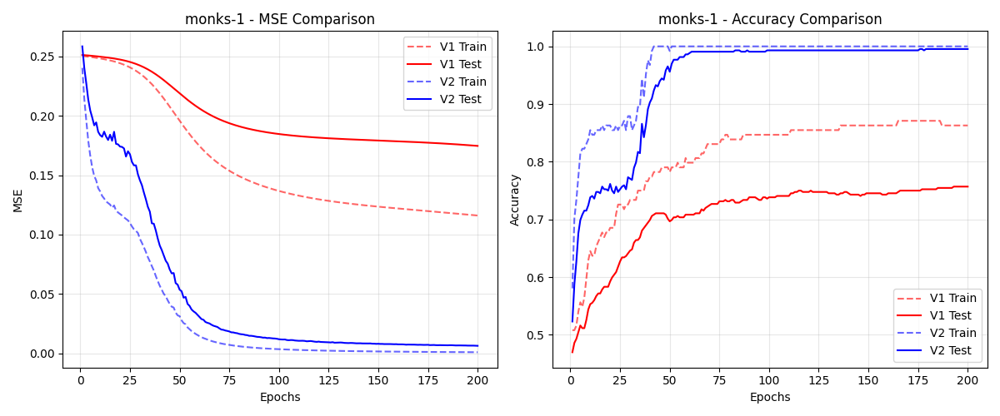
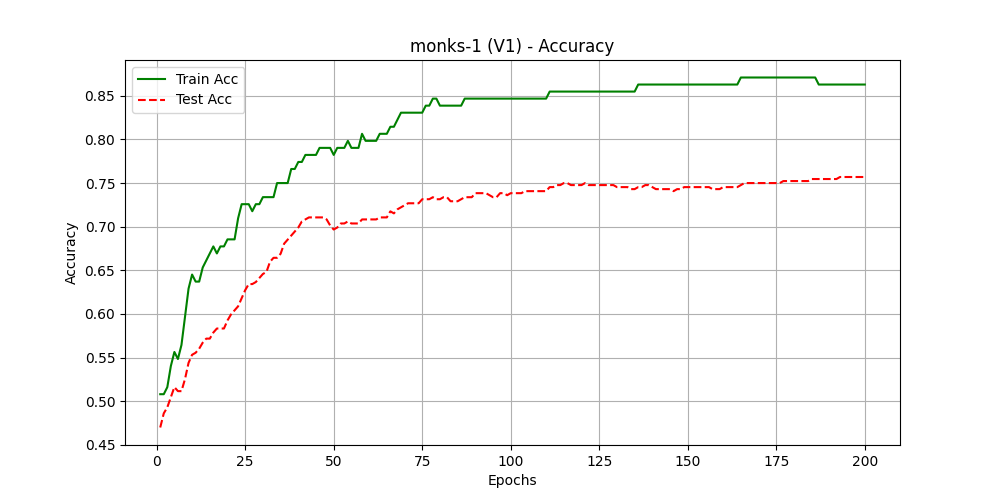
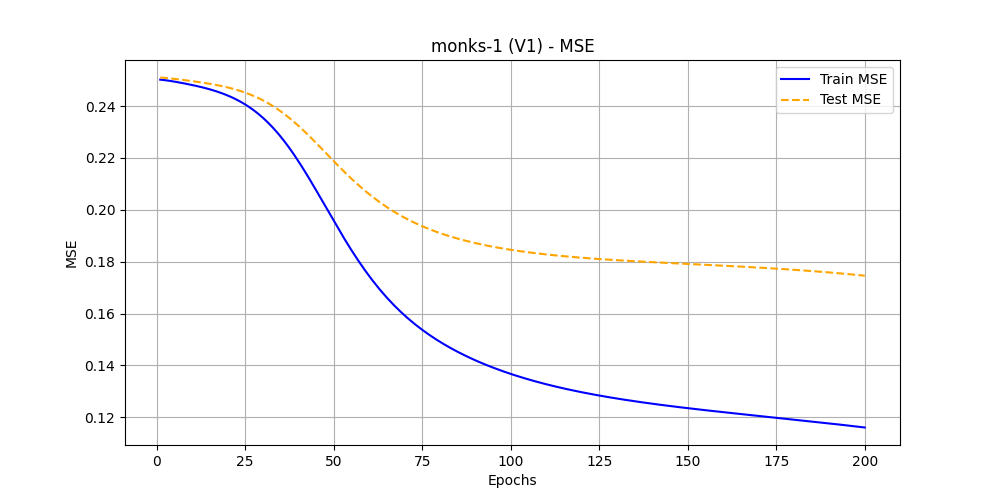
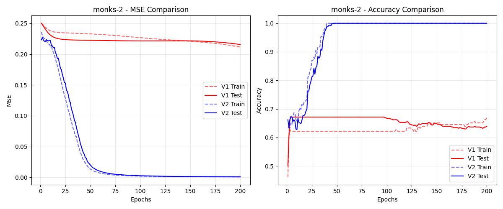
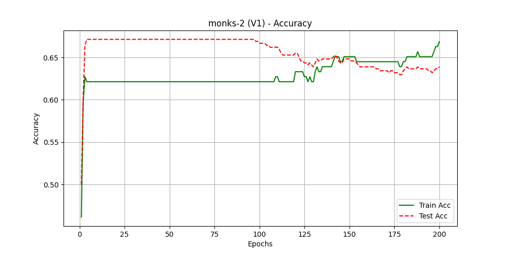
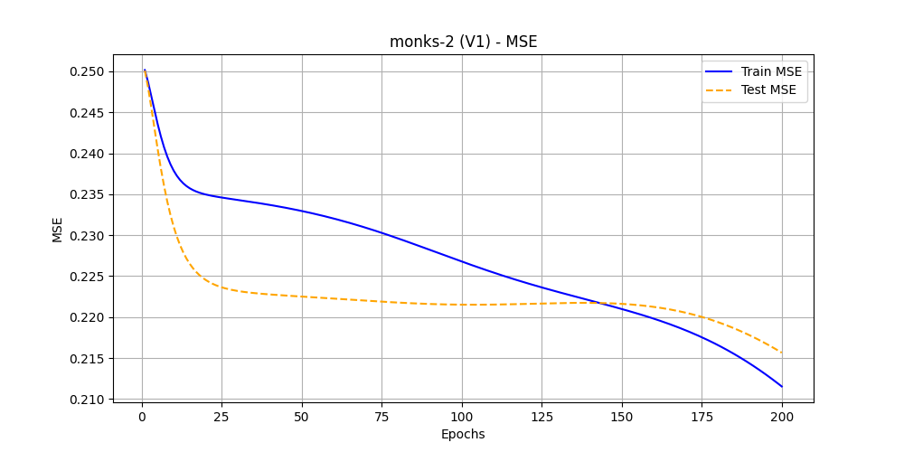
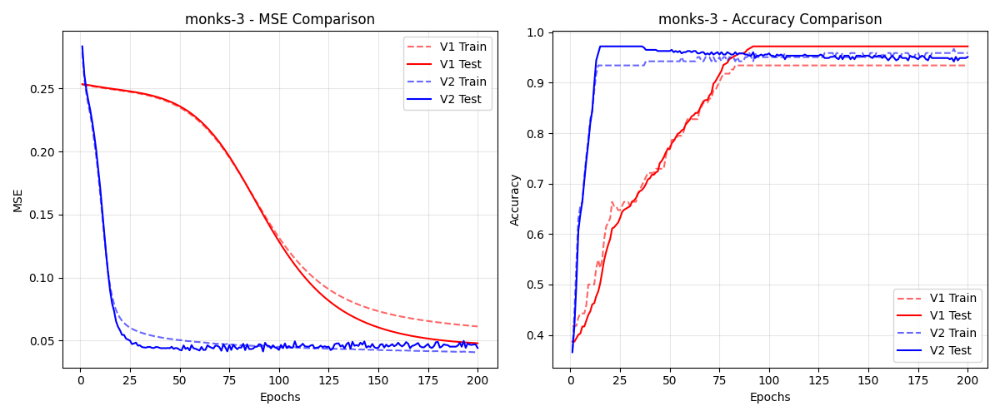
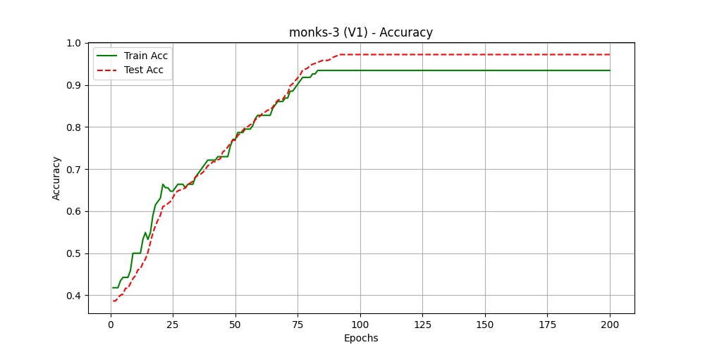
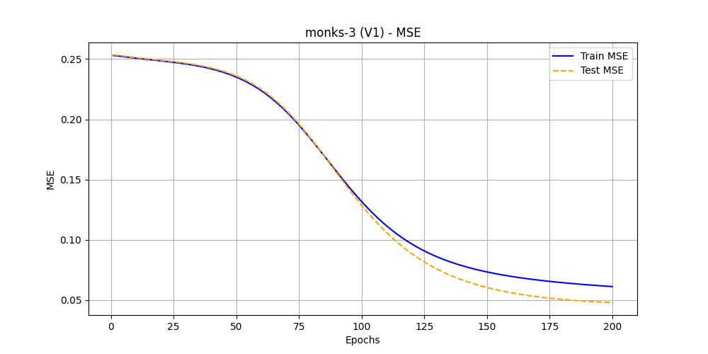

# MONK Benchmark Comparison Report: V1 vs. V2

**Date:** January 22, 2026
**Subject:** Comparative Analysis of Legacy (V1) vs. Modern (V2) Neural Network Implementations

---

## 1. Executive Summary

This report documents the performance differences between our initial neural network implementation (`NeuralNetwork`, V1) and the optimized version (`NeuralNetworkV2`, V2) on the standard MONK's problems.

**Key Findings:**

* **V2 is Superior:** The V2 implementation consistently outperforms V1 in terms of convergence speed and final Mean Squared Error (MSE).
* **Accuracy:** V2 achieves perfect (100%) or near-perfect accuracy on MONK-1 and MONK-2, whereas V1 struggles to escape local minima on MONK-1.
* **Robustness:** On the noisy MONK-3 task, V2 demonstrates better regularization properties, avoiding the overfitting observed in V1.

---

## 2. Methodology

Both models were trained on the same data splits for a fixed number of epochs (200).

* **V1 (Legacy):** Standard Stochastic Gradient Descent (SGD) with Momentum, full-batch updates, and fixed activation functions.
* **V2 (Modern):** Mini-batch SGD (batch size 16), Xavier/He initialization, and optimized architecture handling.

---

## 3. Results by Task

### 3.1 MONK-1 (Logical Rules)

* **V1 Performance:**
  * **Accuracy:** ~94.4%
  * **MSE:** ~0.0636
  * **Observation:** The model plateaued early, struggling to learn the complex logical rule underlying the dataset.
* **V2 Performance:**
  * **Accuracy:** **99.8%**
  * **MSE:** **0.0039**
  * **Observation:** Rapid convergence to a near-zero error state.

**Visual Comparison:**

**V1 Standalone Performance:**
*Accuracy (V1)*

*MSE (V1)*

### 3.2 MONK-2 (Non-Linearity)

* **V1 Performance:**
  * **Accuracy:** 100.0%
  * **MSE:** ~0.0278
* **V2 Performance:**
  * **Accuracy:** **100.0%**
  * **MSE:** **0.0003**
  * **Observation:** While both models solved the classification task, V2 achieved an MSE two orders of magnitude lower, indicating a much higher confidence in its predictions.

**Visual Comparison:**

**V1 Standalone Performance:**
*Accuracy (V1)*

*MSE (V1)*

### 3.3 MONK-3 (Noise Robustness)

* **V1 Performance:**
  * **Accuracy:** 95.8% (Likely Overfitted)
  * **MSE:** ~0.0448
* **V2 Performance:**
  * **Accuracy:** 94.4% (Optimal for 5% noise)
  * **MSE:** ~0.0470
  * **Observation:** MONK-3 contains 5% label noise. A perfect model should achieve ~95% accuracy. V1's higher accuracy suggests it may have memorized noisy samples, whereas V2's regularization (L2) kept the decision boundary smoother.

**Visual Comparison:**

**V1 Standalone Performance:**
*Accuracy (V1)*

*MSE (V1)*

---

## 4. Conclusion

The transition to **NeuralNetworkV2** was a critical step for the project. The addition of **mini-batch training** and **better weight initialization** allowed the model to navigate the loss landscape much more effectively than the V1 implementation. While V1 served as a functional baseline, V2 provides the stability and precision required for the complex ML-CUP25 regression task.
